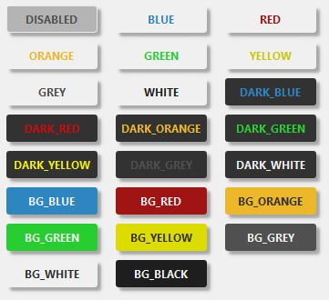

[](https://pypi.python.org/pypi/pyside-ui-backpack/)
[](https://badge.fury.io/py/pyside-ui-backpack)
[](https://github.com/MaxRocamora/ps-ui-backpack)


# ps-ui-backpack
 PySide UI Utilities

Some shared PySide2 UI utilities for Maya/Houdini/Nuke Qt Tools

## Compatibility

- Current release: 1.0.8
- Supported Python versions: 3.9 to 3.15

## Installation

```bash
pip install pyside-ui-backpack
```

## Demos

Run the manual UI demo applications:

```bash
python -m pyside_ui_backpack.demo.demo_push_button_pyside6
python -m pyside_ui_backpack.demo.demo_css_button_pyside6
python -m pyside_ui_backpack.demo.demo_dialogs_pyside6
python -m pyside_ui_backpack.demo.demo_wait_cursor_pyside6
```

## Usage

### Widgets

```python
from pyside_ui_backpack import PushButton, Colors

PushButton(parent, 'qt_name', 'Click Me' , (120, 21) , Colors.BLUE)

```

### Dialogs

```python
from pyside_ui_backpack import dialogs

dialogs.inform_dialog(parent, 'message', 'title')
dialogs.inform_dialog_small(parent, 'message', 'title')
dialogs.warning_dialog(parent, 'error_message', 'title')
dialogs.warning_dialog_small(parent, 'error_message', 'title')

```

### CSS

```python
from pyside_ui_backpack import style_push_button, Colors

# style a button widget
button = QPushButton(main_window)
style_push_button(main_window, button, Colors.BLUE)

```

### Colors

Colors.py contains a list of colors

```python
from pyside_ui_backpack import Colors

Colors.DISABLED Colors.BLUE, Colors.RED, Colors.GREEN, Colors.YELLOW, ...
Colors.DARK_BLUE, Colors.DARK_RED, Colors.DARK_GREEN, Colors.DARK_YELLOW, ...
Colors.BG_BLUE, Colors.BG_RED, Colors.BG_GREEN, Colors.BG_YELLOW, ...
```



### Utils

Wait Cursor decorator

```python
from pyside_ui_backpack import wait_cursor

@wait_cursor
def long_running_function():
    pass
```

## Changelog (Latest)

- 1.0.8 (03/2026)
- Package version bumped to 1.0.8.
- Python support updated to 3.9 through 3.15.
- Compatibility and typing improvements for PySide2/PySide6 APIs.
- Demo scripts moved to `pyside_ui_backpack/demo` and automated tests expanded.
- README examples corrected and aligned with current package imports.

## Future Update Note

In a future release, support for PySide2 and Python 3.9/3.10 will be dropped.
